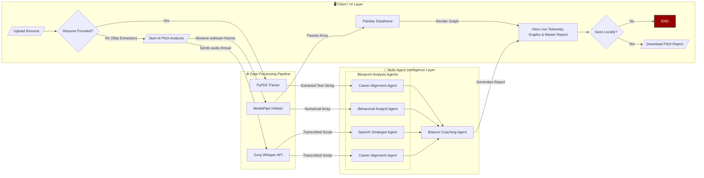

# Blueprint & Beacon: AI Elevator Pitch Coach

**Developer:** Justine Chloyd Lechico  
**Institution:** Asia Pacific College (SoCIT)

## Project Overview
Blueprint & Beacon is an advanced multi-agent AI system designed to transform how professionals prepare for high-stakes elevator pitches. Traditional presentation coaching relies on subjective human feedback and lacks precise timeline tracking. This application solves that by recording a 60-second pitch, capturing real-time physical and vocal telemetry, and synthesizing that data through a team of specialized AI agents to generate an actionable, timeline-backed Master Report.

## System Architecture
The application features a decoupled, multi-agent architecture separated into three distinct layers:

1. **Client / UI Layer (Streamlit & Pandas):** Handles user data ingestion (optional resume PDF upload, 60-second webcam/microphone recording) and renders the final Master Report with dynamic telemetry graphs.
2. **Data Processing Pipeline:** Extracts clean vectors before AI processing. 
    * **PyPDF:** Parses the resume context.
    * **MediaPipe Holistic:** Tracks time-series facial landmarks (visual focus) and wrist vectors (kinetic energy).
    * **Groq Whisper API:** Generates an instant, highly accurate text transcript of the audio.
3. **Multi-Agent Intelligence Layer (CrewAI):** 
    * **The Blueprint Team (Parallel Execution):** 
        * *Behavioral Analyst Agent:* Evaluates physical presence and eye contact ratios.
        * *Speech Strategist Agent:* Evaluates vocal pacing, delivery, and clarity.
        * *Career Alignment Engine:* Cross-references the spoken pitch against the provided resume to identify missed opportunities.
    * **The Beacon Agent (Synthesizer):** Aggregates the Blueprint team's critiques into a cohesive, non-contradictory executive coaching report.

## Tech Stack & Libraries
* **Frontend:** Streamlit, Pandas (Data processing for graphs)
* **Computer Vision & Audio:** OpenCV (`cv2`), MediaPipe, Sounddevice
* **AI Orchestration:** CrewAI
* **LLM Backend:** Groq Inference Engine (`llama-4-scout-17b-16e-instruct`)
* **Transcription & Parsing:** Groq Whisper API, PyPDF

## Setup & Installation Instructions

**1. Clone the Repository**
git clone [https://github.com/yourusername/blueprint-and-beacon.git](https://github.com/yourusername/blueprint-and-beacon.git)
cd blueprint-and-beacon

**2. Create a Virtual Environment**
python -m venv venv
source venv/bin/activate  # On Windows use: venv\Scripts\activate

**3. Install Dependencies**
pip install -r requirements.txt

**4. Setup Environment Variables**
GROQ_API_KEY=your_groq_api_key_here

**5. Run the App**
streamlit run app.py
